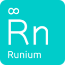

Runium
======

|Travis build status| |PyPI version shields.io| |PyPI pyversions| |Documentation Status| |GitHub license|

.. |Travis build status| image:: https://travis-ci.org/AGTGreg/runium.svg?branch=master
   :target: https://travis-ci.org/AGTGreg/runium

.. |PyPI version shields.io| image:: https://img.shields.io/pypi/v/runium.svg
   :target: https://pypi.org/project/runium/

.. |PyPI pyversions| image:: https://img.shields.io/pypi/pyversions/runium.svg
   :target: https://pypi.org/project/runium/

.. |Documentation Status| image:: https://readthedocs.org/projects/runium/badge/?version=latest
   :target: https://runium.readthedocs.io/en/latest/main.html

.. |GitHub license| image:: https://img.shields.io/github/license/AGTGreg/runium.svg
   :target: https://github.com/AGTGreg/runium/blob/master/LICENSE

Runium is a Python library that makes it easy to write non-blocking,
asynchronous tasks.

You can add new tasks as you please, choose when and how to execute them as
**Threads** or **Processes** and attach callbacks to be executed as soon as the
task is finished running. Run those tasks once or periodically or schedule to
run them at a specific time.

The purpose of Runium is to do these simple, easy and clean with minimum to
no changes to your code. Just one line of code is all it takes.

**Documentation** `https://runium.readthedocs.io/en/latest/main.html <https://runium.readthedocs.io/en/latest/main.html>`_

**Github:** `https://github.com/AGTGreg/runium <https://github.com/AGTGreg/runium>`_

**Pypi:** `https://pypi.org/project/runium/ <https://pypi.org/project/runium/>`_

Features
========
* **Concurrency**: Run a task once or many times in its own Thread or Process.
* **Repetition**: Run tasks periodically on even time intervals. Optionally for a certain amount of times.
* **Scheduling**: Run tasks at a certain date and time.
* **Callbacks**: Runium tasks can accept callback functions which are executed when the task is finished running.
* **Simplicity and Readability**: Do all the above in a single line of code that is easy to read.

Installation
============

Runium is distributed on PyPI. The best way to install it is with pip:

.. code-block:: console

    $ pip install runium

Quickstart
==========

**A basic example:**

.. code-block:: python

    from runium.core import Runium

    def task():
        print("I am working...")

    # Initialize Runium
    rn = Runium()

    # Create a task
    async_task = rn.new_task(task)

    # Run it. This will return a future object.
    future = async_task.run()

    # Then you can wait for the result.
    future.result()

    # Of course you can do all these in one line :)
    rn.new_task(task).run().result()

**Callbacks:**

.. code-block:: python

    async_task.on_finished(callback).run()

    async_task.on_success(s_callback).on_error(e_callback).run()

    async_task.on_iter(callback).run()

**Choose how, when and how many times a task should run:**

.. code-block:: python

    # Run it multiple times...
    future = async_task.run(times=3)

    # ...every 1 hour
    future = async_task.run(every='1 hour', times=3)

    # Or tell Runium to start the task in a specific time
    future = async_task.run(start_in='5 hours')

    # All the methods above will return a future object. You can use result()
    # to wait for it.
    future.result()

    # Here it is in one line :)
    rn.new_task(task).run(every='1 second', times=3).result()

Authors
=======

`Grigoris Chatzinikolaou <www.linkedin.com/in/greg-chatzinikolaou-bba1927>`_
