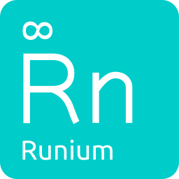

Runium
======

|Travis build status| |Code Climate maintainability| |PyPI version shields.io| |PyPI pyversions| |Documentation Status| |GitHub license|

.. |Travis build status| image:: https://travis-ci.org/AGTGreg/runium.svg?branch=master
   :target: https://travis-ci.org/AGTGreg/runium

.. |Code Climate maintainability| image:: https://api.codeclimate.com/v1/badges/e5155e4439eec7e39be5/maintainability
   :target: https://codeclimate.com/github/AGTGreg/runium/maintainability

.. |PyPI version shields.io| image:: https://img.shields.io/pypi/v/runium.svg
   :target: https://pypi.org/project/runium/

.. |PyPI pyversions| image:: https://img.shields.io/pypi/pyversions/runium.svg
   :target: https://pypi.org/project/runium/

.. |Documentation Status| image:: https://readthedocs.org/projects/runium/badge/?version=latest
   :target: https://runium.readthedocs.io/en/latest/main.html

.. |GitHub license| image:: https://img.shields.io/github/license/AGTGreg/runium.svg
   :target: https://github.com/AGTGreg/runium/blob/master/LICENSE

Runium is a Python library that makes it easy to write non-blocking,
asynchronous tasks.

You can add new tasks as you please, choose when and how to execute them as
**Threads** or **Processes** and attach callbacks to be executed as soon as the
task is finished running. Run those tasks once or periodically or schedule to
run them at a specific time.

The purpose of Runium is to do these simple, easy and clean with minimum to
no changes to your code. Just one line of code is all it takes.

**Documentation** `https://runium.readthedocs.io/en/latest/main.html <https://runium.readthedocs.io/en/latest/main.html>`_

**Github:** `https://github.com/AGTGreg/runium <https://github.com/AGTGreg/runium>`_

**Pypi:** `https://pypi.org/project/runium/ <https://pypi.org/project/runium/>`_
